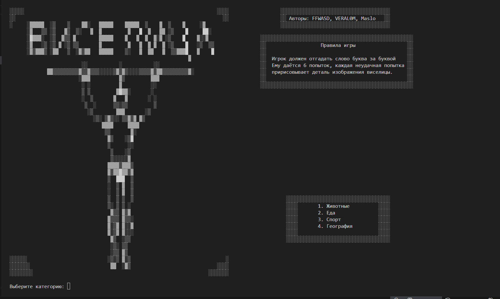

# 🔥 Игра «Виселица»
Простая версия популярной классической игры «Виселица» для командной строки на Python. Попробуйте угадать слово по буквам!

## ⚙️ Что внутри репозитория?

| Файлы           | Описание                   |
|-----------------|----------------------------|
| `human_image.py` | Модуль с изображениями виселицы |
| `secrets_mod.py` | Дополнительный модуль       |
| `main.py`        | Основной исполняемый файл   |

## 👨‍💻 Авторы проекта
VERAL0M: Реализация красивого вывода виселицы, реализация возможности повторного запуска игры, создание основного цикла игры и инструкции по игре.
FFWasd: Основная логика игры, разработка рабочего прототипа игрового процесса.
Oilovich: Дополнительный режим игры, тестирование игры и поиск уязвимостей. 

## 📌 Структура проекта
Игровой процесс состоит из выбора категории («животные», «еда», «спорт», «география»), задания случайно выбранного слова и последующих ходов игрока. За каждый неправильный выбор увеличивается счётчик ошибок, ведущий к поражению.

## 🛠️ Установка и запуск
Чтобы начать играть, выполните следующие шаги:

Убедитесь, что у вас установлен Python 3.x.
Клонируйте или скачайте репозиторий.
Перейдите в каталог проекта.
Выполните команду:python main.py
## 🎯 Правила игры
Вам предлагается выбрать одну из категорий («животные», «еда», «спорт», «география»).
Компьютер выбирает случайное слово из выбранной категории.
Ваша задача — угадать это слово, вводя буквы по очереди.
Если ваша попытка неудачная, появляется дополнительная деталь на рисунке виселицы.
Вы выигрываете, если успеваете угадать слово до полного построения рисунка виселицы.
## 🗺️ Управление игрой
Во время каждого хода вам предлагается ввести одну букву. Если вы ввели неверную букву или символ, появится сообщение об ошибке. Для удобства предусмотрено очищение терминала перед каждым ходом.

## 🖼️ Скриншоты
Пример интерфейса игры при первом запуске:

